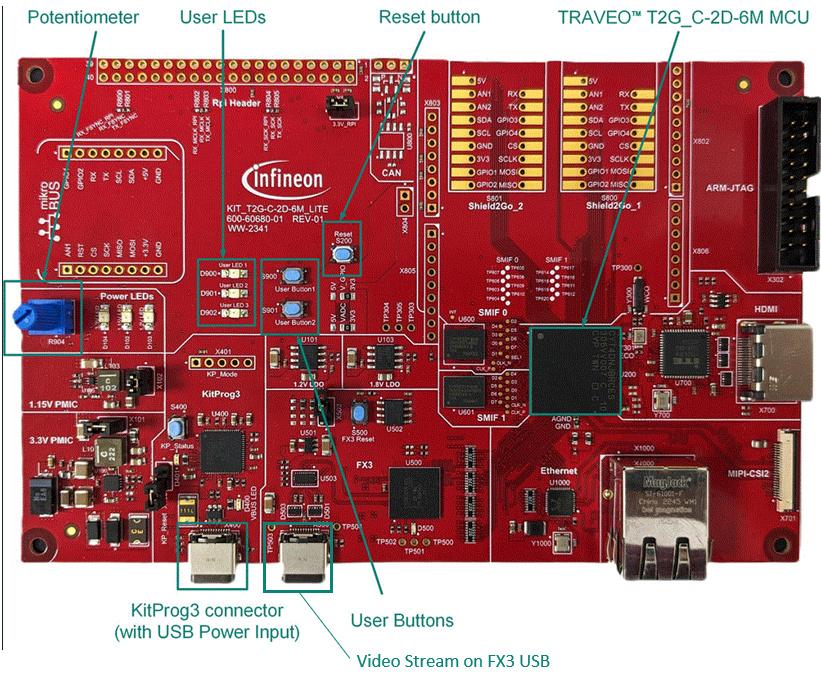
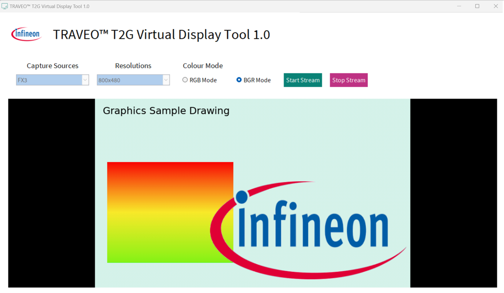

# Demonstration: Sample Drawing 

**This Demonstration is for checking the display of a graphics image generated by Qt Design Studio via TRAVEO&trade; T2G Virtual Display Tool. This demonstration shows the basic steps to use the Graphics Driver. It executes some simple graphical operations such as multiple color gradients.**  

**Note:** This software modifications may not work correctly. Also, copy and republishing of this software assets is inhibited. 

## Device

The device used in this demonstration is:
- [TRAVEO&trade; T2G CYT4DN Series](https://www.infineon.com/cms/en/product/microcontroller/32-bit-traveo-t2g-arm-cortex-microcontroller/32-bit-traveo-t2g-arm-cortex-for-cluster/traveo-t2g-cyt4dn/)

## Board

The board used for testing is:
- TRAVEO&trade; T2G Cluster 6M Lite Kit ([KIT_T2G_C-2D-6M_LITE](https://www.infineon.com/cms/en/product/evaluation-boards/kit_t2g_c-2d-6m_lite/))

## Scope of work
Through the integration of TRAVEO&trade; T2G MCU and Qt Design Studio design objects, it is possible to use the Qt Design Studio tool to create UI designs for TRAVEO&trade; microcontrollers and build and deploy them as part of the application.
In this demonstration, you can display and check the graphics images designed with Qt Design Studio using TRAVEO&trade; T2G Virtual Display Tool.  
This demonstration shows the basic steps to use the Graphics Driver. It executes some simple graphical operations such as multiple color gradients.

## Introduction

**Graphic Subsystems**
- Supports 2D and 2.5D (perspective warping, 3D effects) graphics rendering
- 40-bit for internal processing (RGBA 10-bit per color channel)
- 24-bit for interfaces (RGB 8-bit per color channel)
- 4096 KB of embedded video RAM memory (VRAM)
- Up to two video output interfaces supporting two displays from
  - Parallel RGB (max display size: 1600 × 600 at 80 MHz) 
  - FPD-link single (max display size: 1920 × 720 at 110 MHz) 
  - FPD-link dual (max display size: 2880 × 1080 at 220 MHz)
- One Capture engine for video input processing for ITU 656 or parallel RGB/YUV or MIPI CSI-2 input
  - ITU656 (standard camera capture: up to 800 × 480)
  - RGB (max capture size 1600 × 600 at 80 MHz) or 
  - Two-/four-lane MIPI CSI-2 interface (max capture size: 1920 × 720 for two lanes at 110 MHz, 2880 × 1080 for four lanes at 220 MHz)
- Display warping on-the-fly for HUD applications
- Direct video feed through from capture to display interface with graphics overlay
- Composition engine for scene composition from display layers
- Display engine for video timing generation and display functions
- Drawing engine for acceleration of vector graphics rendering
- Command sequencer for setup and control of the rendering process
- Supports graphics rendering without frame buffers (on-the-fly to both displays)
- Dual-channel FPD-Link interface for up to Wide-HD resolution video output
- JPEG Decoder
  - Decodes JPEG images of various formats into pixel data with conformance to a subset of standard ISO/IEC10918-1
  - Color spaces supporting RGB/YUV/Grayscale
  - Supports YUV sub-sampling 4:4:4/4:2:2/4:1:1/4:2:0
  - Image size between 1×1 to 16384×16384 pixels

More details can be found in:
- TRAVEO&trade; T2G CYT4DN
    - [Technical Reference Manual (TRM)](https://www.infineon.com/dgdl/?fileId=8ac78c8c8691902101869f03007d2d87)
    - [Registers TRM](https://www.infineon.com/dgdl/?fileId=8ac78c8c8691902101869ef098052d79)
    - [Data Sheet](https://www.infineon.com/dgdl/?fileId=8ac78c8c869190210186f0cceff43fd0)

## Hardware setup

This demonstration has been run for:
- TRAVEO&trade; T2G Cluster 6M Lite Kit ([KIT_T2G_C-2D-6M_LITE](https://www.infineon.com/cms/en/product/evaluation-boards/kit_t2g_c-2d-6m_lite/)) 

**Figure 1. KIT_T2G_C-2D-6M_LITE (Top View)**

 
No changes are required from the board's default settings.

## Run the demonstration

**Note:** You need to download [TRAVEO&trade; T2G Virtual Display Tool](https://softwaretools-preview.icp.infineon.com/tools/com.ifx.tb.tool.traveot2gvirtualdisplaytool) in advance. Because this demonstration uses the FX3 controller to display. Please make sure you have installed Qt Design Studio and have a valid license.

After demonstration example compilation, perform the following steps to flashing the device:

1. Connect the board to your PC using the provided USB cable through the KitProg3 USB connector.
2. Program the board using one of the following:
    - Select the demonstration project in the Project Explorer.
    - In the **Quick Panel**, scroll down, and click **[Project Name] Program (KitProg3_MiniProg4)**.
3. After programming, the demonstration starts automatically.

4. Connect the board to your PC using the provided USB cable through the FX3 USB for outputting the graphics image.
    - Note: It is not necessary to connect the Kitprog3 USB and the FX3 USB at the same time.
5. Launch the TRAVEO&trade; T2G Virtual Display Tool.
 
6. Set the parameters on the TRAVEO&trade; T2G Virtual Display Tool to run this demonstration and push the Start stream button.

7. It will be displayed the image from TRAVEO&trade; T2G Virtual Display Tool

 
More details can be found in:

refer to [Steps to use the Qt Design Studio using the ModusToolbox&trade; ](https://www.infineon.com/dgdl/?fileId=8ac78c8c9715623e01973b3fe6e520a4)

## References  

Relevant Application notes are:

- [AN235305](https://www.infineon.com/dgdl/?fileId=8ac78c8c8b6555fe018c1fddd8a72801) - Getting started with TRAVEO&trade; T2G family MCUs in ModusToolbox&trade;

ModusToolbox&trade; is available online:
- <https://www.infineon.com/modustoolbox>

Associated TRAVEO&trade; T2G MCUs can be found on:
- <https://www.infineon.com/cms/en/product/microcontroller/32-bit-traveo-t2g-arm-cortex-microcontroller/>

More code examples can be found on the GIT repository:
- [TRAVEO&trade;T2G Code examples](https://github.com/orgs/Infineon/repositories?q=mtb-t2g-&type=all&language=&sort=)

For additional trainings, visit our webpage:
- [Steps to use the Qt Design Studio using the ModusToolbox&trade;](https://www.infineon.com/dgdl/?fileId=8ac78c8c9715623e01973b3fe6e520a4)

- [TRAVEO&trade; T2G trainings](https://www.infineon.com/cms/en/product/microcontroller/32-bit-traveo-t2g-arm-cortex-microcontroller/32-bit-traveo-t2g-arm-cortex-for-cluster/traveo-t2g-cyt4dn/#!trainings)

For questions and support, use the TRAVEO&trade;T2G Forum:  
- <https://community.infineon.com/t5/TRAVEO-T2G/bd-p/TraveoII>  
